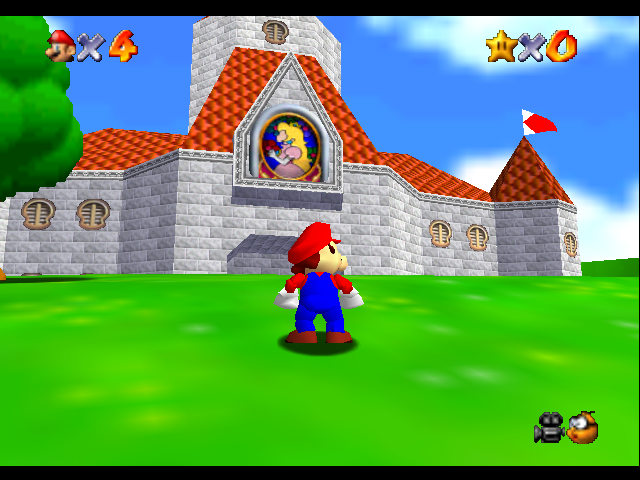

# UltraHLE

UltraHLE is a classic Nintendo 64 emulator. A masterpiece.

The sources are taken from here: https://code.google.com/archive/p/ultrahle/downloads

Tidied up for building under Visual Studio 2022.

## Directory structure

- src: original slightly modified sources
- Build: this is where the executable will be built
- Scripts: project for VS2022, which pulls sources and everything else from the original src folder by links.
- XGLIDE_Decompile: decompiling the XGLIDE library.

## How the sources are modified

- Added `_CRT_SECURE_NO_WARNINGS` macro for unsafe calls
- The `RELEASE=1` macro must be defined for Release builds, otherwise the console code will crash immediately after starting the emulator
- `stricmp` replaced by `_stricmp`
- `memicmp` replaced by `_memicmp`
- `strlwr` replaced by `_strlwr`.
- Unicode: Not Set (UltraHLE does not use Unicode)
- Minor fixes in UltraHLE.rc and RESOURCE.H
- Executable base address should be 0 (Linker->Advanced); If you are unsure about the recompiler, you can replace the `go` call with `sgo` in MAIN.C (`breakcommand("sgo");`)
- A decompiled version of the library is used instead of XGLIDE.LIB
- Correctly disabled DEBUGUI.C for Release builds

## Build

You don't need to do anything special. You can build in Debug/Release x86 configuration.

x64 build is not supported because UltraHLE uses inline assembler in .C files, which cannot be used in x64.

## Glide

UltraHLE requires the deprecated Glide 2.0 graphics API.

Wrapper is available here: http://www.zeckensack.de/glide/

Sometimes the screen brightness is disturbed after starting the wrapper in Windows. To reset it, just press Win+I and go to the Display tab.
