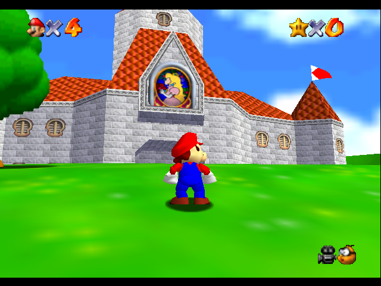

# UltraHLE

UltraHLE is a classic Nintendo 64 emulator. A masterpiece.

The sources are taken from here: https://code.google.com/archive/p/ultrahle/downloads

Tidied up for building under Visual Studio 2026.

## Directory structure

- src: original modified sources
- Build: this is where the executable will be built
- Scripts: project for VS2026, which pulls sources and everything else from the original src folder by links.
- XOpenGL: the X library, ported from Glide to OpenGL.
- XGLIDE_Decompile: decompiling the original XGLIDE library. Kept for educational/historical purposes only.

## Build

You don't need to do anything special. You can build in Debug/Release x86 or x64 configuration.

x86 build uses the recompiler (JIT). x64 build works in interpreter mode only: the original inline assembler (cpua) is not portable to x64, so the emulator falls back to the C interpreter there. The x64 JIT files are excluded from the project.

## Graphics

The X library no longer requires Glide: it has been ported to OpenGL (compatibility profile). No Glide wrapper is needed anymore.

The original Glide 2.0 graphics API is only referenced by the historical XGLIDE_Decompile sources, which are kept for reference.

## Documentation

Doxygen is used to document `src` and `XOpenGL`. Run from the repository root:

    doxygen Doxyfile

Output:

- HTML documentation — `docs/html`
- LaTeX sources — `docs/latex`; build the PDF with:

      make -C docs/latex

The PDF is written to `docs/latex/refman.pdf`.
