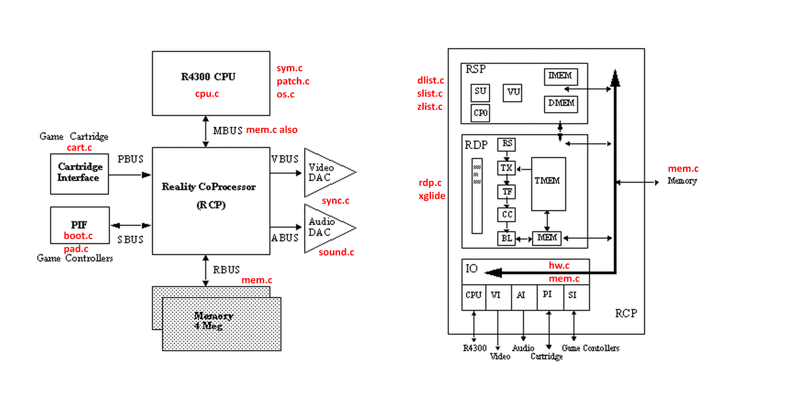

# UltraHLE Wiki

A little overview of how UltraHLE works. Of course, you have already read `ultra.h`.

The .C modules that are responsible for emulating the corresponding components of the N64 architecture are marked on the image:

What follows will just be random facts, for simplicity's sake.

## CPU

- Exceptions and interrupts are not emulated (this is handled by os.c)

## RSP

- ISA is not emulated at all. All emulation is based on replication of RSP microcode by means of C.
- XBUS: primitives are not transferred to RDP, instead they are sent directly to the xglide library.

## RDP

- Lots of buildup, overall the graphics look good and authentic

## IO

- VI: is not emulated as such (video buffer). There is minimal support for "kicking up" VI counters so that the game does not hang

## PIF

- Boot emulation skips almost all stages (IPL1, IPL2, IPL3 are not emulated), which possibly affects game compatibility, but is not really investigated yet.
- Emulation of saving to NVRAM of the cartridge is not supported (TODO)
